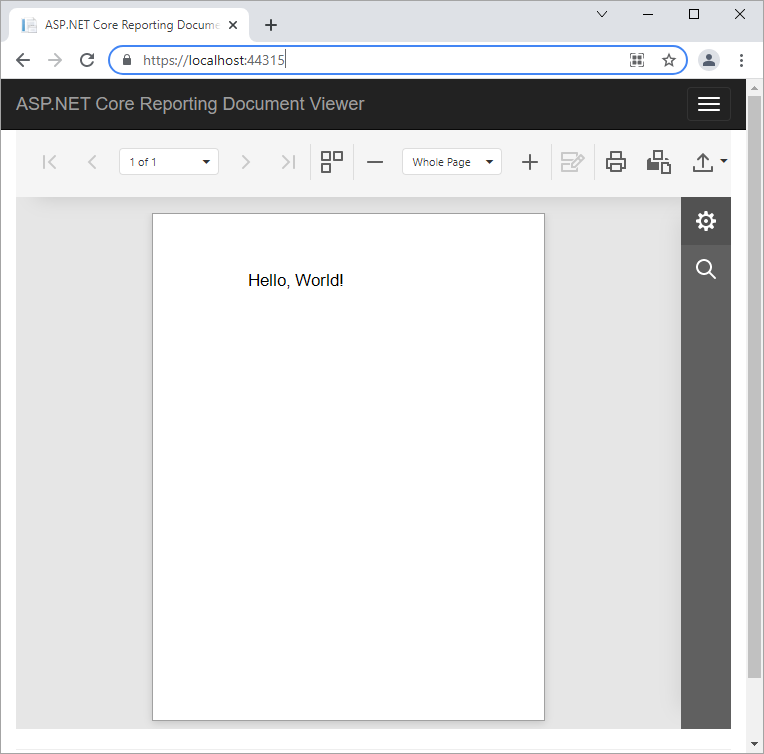

<!-- default badges list -->

<!-- default badges end -->
<!-- default file list -->
*Files to look at*:
* [Index.cshtml](./CS/SimpleAspNetCoreReportingViewer/Views/Home/Index.cshtml)
* [Startup.cs](./CS/SimpleAspNetCoreReportingViewer/Startup.cs) 
* [_Layout.cshtml](./CS/SimpleAspNetCoreReportingViewer/Views/Shared/_Layout.cshtml)
<!-- default file list end -->

# How to Add the Document Viewer to an ASP.NET Core Application

This example is the resulting project if you follow the steps described in the [Add the Document Viewer to an ASP.NET Core Application](https://docs.devexpress.com/XtraReports/400043) document.

> Restore packages (listed in the [package.json](./CS/SimpleAspNetCoreReportingViewer/package.json) file) before running this project. For more information review the following article: [Restore packages using Package Restore](https://docs.microsoft.com/en-us/nuget/consume-packages/package-restore).

